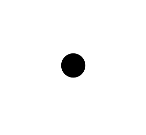
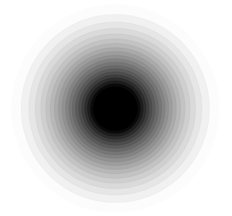

<!-- README.md is generated from README.Rmd. Please edit that file -->

```{r, include = FALSE}
knitr::opts_chunk$set(
  collapse = TRUE,
  comment = "#>",
  fig.path = "man/figures/README-",
  out.width = "100%"
)

library(ggplot2)
library(ggblur)
```


```{r echo = FALSE, eval = FALSE}
# Quick logo generation. Borrowed heavily from Nick Tierney's Syn logo process
library(magick)
library(showtext)
font_add_google("Racing Sans One", "gf")


# pkgdown::build_site(override = list(destination = "../coolbutuseless.github.io/package/ggblur"))
```


```{r echo = FALSE, eval = FALSE}
img <- image_read("man/figures/white.png")


hexSticker::sticker(subplot  = img,
                    s_x      = 0.92,
                    s_y      = 1.2,
                    s_width  = 1.5,
                    s_height = 0.95,
                    package  = "ggblur",
                    p_x      = 1,
                    p_y      = 1,
                    p_color  = "#223344",
                    p_family = "gf",
                    p_size   = 9,
                    h_size   = 1.2,
                    h_fill   = "#ffffff",
                    h_color  = "#223344",
                    filename = "man/figures/logo.png")

image_read("man/figures/logo.png")
```


# ggblur   

<!-- badges: start -->

<!-- badges: end -->

`ggblur` provides `geom_point_blur()` for use in `ggplot` - this geom allows you 
to control the blurriness of the drawn points, but is otherwise
identical to the standard `geom_point()`.


#### What's in the box?

* `geom_point_blur()`
    * same as `geom_point()` but now accepts `blur_size` as an aesthetic
    * also allows for control of the smoothness of the blur (`blur_steps`)
* `scale_blur_size_continuous()`, `scale_blur_size_discrete()` and `scale_blur_size_manual()` 
   for controlling `blur_size` when used as a mapped aesthetic/


#### Similar packages

* [ggecho](https://github.com/coolbutuseless/ggecho) is an earlier experiment of
  mine from 2019 where I echo components using a custom stat `stat_echo`.  This 
  solution works across multiple geoms, but didn't allow for adjusting the
  echo for individual points.
* [ggfx](https://github.com/thomasp85/ggfx) adds blur at the layer level i.e. 
  no individual control over the amount of blur for each point.


#### How it works

Blur is simulated by keeping the original point, and drawing a sequence of 
larger, faded points behind it (illustrated below).

The number of 
points rendered is controlled by `blur_steps` and the distance to which the 
blur extends beyond the edge of the original point is controlled by `blur_size`.

Note: Paul Murrell has some experiments to add radial gradients to grid graphics
(see [his github](https://github.com/pmur002/r-defs-proposal)) and if this 
  becomes part of grid it may be a better method of simulating blur.


<div>


</div>

<div style="clear: both;" />

## Installation

You can install the development version from [GitHub](https://github.com/coolbutuseless/ggblur) with:

``` r
# install.packages("devtools")
devtools::install_github("coolbutuseless/ggblur")
```

## Example 1 - constant `blur_size` 

When not used as a mapped aesthetic within `aes()`, the same `blur_size` is
applied to every point.

```{r example1}
library(ggplot2)
library(ggblur)

ggplot(mtcars) +
  geom_point_blur(aes(mpg, wt), blur_size = 10) +
  theme_bw() + 
  labs(title = "Same blur for each point")
```

## Example 2 - mapping `blur_size` as an aesthetic

When used as a mapped aesthetic within `aes()`, the `blur_size` is calculated
individually for each point.

```{r example2}
library(ggplot2)
library(ggblur)

ggplot(mtcars) +
  geom_point_blur(aes(mpg, wt, blur_size = disp)) +
  theme_bw() + 
  labs(title = "Larger blur indicates larger engine displacement")
```


## Example 3 - control over blur parameters

`blur_steps` and `scale_blue_size_continuous/discrete/manual()`
can be used to further customise the appearance.


```{r example3}
ggplot(mtcars) +
  geom_point_blur(aes(mpg, wt, blur_size = disp), blur_steps = 3) +
  scale_blur_size_continuous(range = c(1, 15)) +
  theme_bw() + 
  labs(title = "Larger blur indicates larger engine displacement")
```


## Example 4 - blur with colour


```{r example4}
ggplot(mtcars) +
  geom_point_blur(aes(mpg, wt, blur_size = disp, colour = as.factor(cyl))) +
  scale_blur_size_continuous(range = c(1, 15)) +
  theme_bw() + 
  labs(title = "Larger blur indicates larger engine displacement")
```


