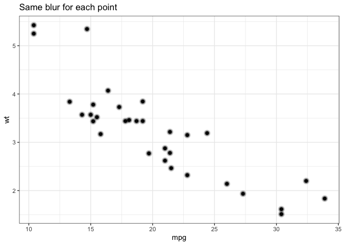
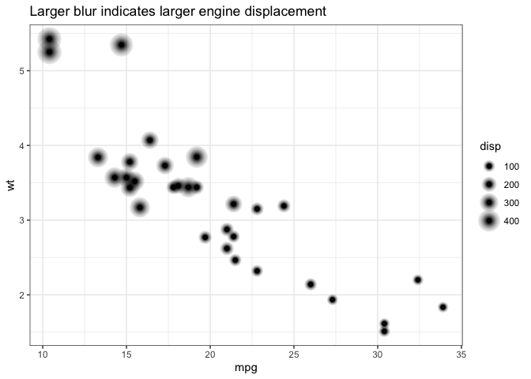
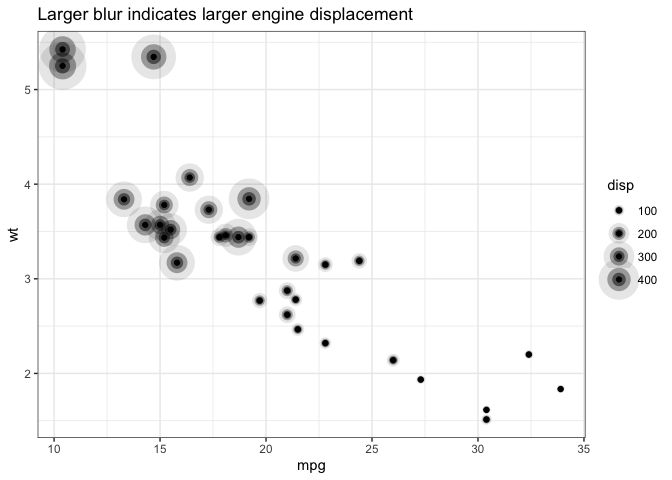

<!-- README.md is generated from README.Rmd. Please edit that file -->

# ggblur 

<!-- badges: start -->


<!-- badges: end -->

`ggblur` provides an augmented version of `geom_point()` which adds
**blur** as an aesthetic.

#### What’s in the box?

  - `geom_point_blur()`
      - same as `geom_point()` but accepts `blur_size` as a mappable
        aesthetic
      - also allows for setting of `blur_steps` and `blur_alpha`
  - `scale_blur_size_continuous()`, `scale_blur_size_discrete()` and
    `scale_blur_size_manual()` for controlling blur size.

#### Similar packages

  - [ggecho](https://github.com/coolbutuseless/ggecho) is an earlier
    experiment of mine from 2019 where I echo components using a custom
    stat `stat_echo`. This solution works across multiple geoms, but
    didn’t allow for adjusting the echo for individual points.
  - [ggfx](https://github.com/thomasp85/ggfx) adds blur at the layer
    level i.e.  no individual control over the amount of blur for each
    point.

#### How it works

Given the current lack of radial gradients in grid graphics, blur is
simulated by rendering multiple points at the given location.

However, Paul Murrell has some experiments to add radial gradients to
grid graphics - see [his
github](https://github.com/pmur002/r-defs-proposal). When this
eventuates

## Installation

You can install the development version from
[GitHub](https://github.com/coolbutuseless/ggblur) with:

``` r
# install.packages("devtools")
devtools::install_github("coolbutuseless/ggblur")
```

## Example 1 - constant `blur_size`

This is a basic example which shows you how to solve a common problem:

``` r
library(ggplot2)
library(ggblur)

ggplot(mtcars) +
  geom_point_blur(aes(mpg, wt), blur_size = 10) +
  theme_bw() + 
  labs(title = "Same blur for each point")
```



## Example 2 - mapping `blur_size` as an aesthetic

This is a basic example which shows you how to solve a common problem:

``` r
library(ggplot2)
library(ggblur)

ggplot(mtcars) +
  geom_point_blur(aes(mpg, wt, blur_size = disp)) +
  theme_bw() + 
  labs(title = "Larger blur indicates larger engine displacement")
```



## Example 3 - control over blur parameters

``` r
ggplot(mtcars) +
  geom_point_blur(aes(mpg, wt, blur_size = disp), blur_alpha = 0.3, blur_steps = 2) +
  scale_blur_size_continuous(range = c(1, 15)) +
  theme_bw() + 
  labs(title = "Larger blur indicates larger engine displacement")
```


